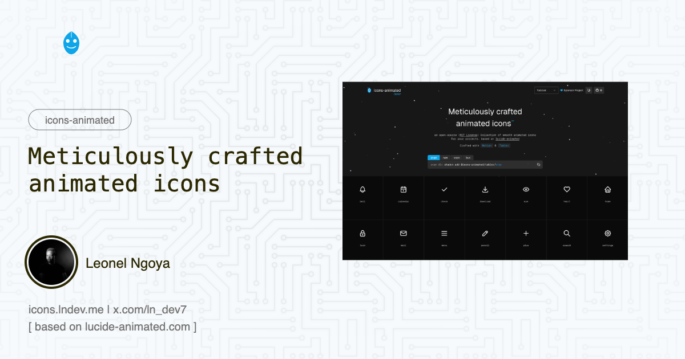

# icons-animated

Meticulously crafted animated icons.



> 🎄 Based on the amazing [lucide-animated](https://lucide-animated.com/) project by [@pqoqubbw](https://x.com/pqoqubbw)

## Links

- **Demo** → [icons.lndev.me](https://icons.lndev.me)
- **Sponsor** → [Support the project](https://ecaefmew.mychariow.shop/prd_3cu1s0)
- **Original project** → [lucide-animated.com](https://lucide-animated.com/)

## Icon Libraries

This project provides animated icons for:

- **[Huge Icons](https://hugeicons.com/)** - A beautifully crafted icon library with 4000+ free icons
- **[Tabler Icons](https://tabler.io/icons)** - A set of free MIT-licensed high-quality SVG icons
- **[Phosphor Icons](https://phosphoricons.com/)** - A flexible icon family for interfaces, diagrams, presentations

## Installation

Install icons using the shadcn CLI:

```bash
# Huge Icons
pnpm dlx shadcn add @icons-animated/hugeicons-heart
pnpm dlx shadcn add @icons-animated/hugeicons-search

# Tabler Icons
pnpm dlx shadcn add @icons-animated/tabler-heart
pnpm dlx shadcn add @icons-animated/tabler-search

# Phosphor Icons
pnpm dlx shadcn add @icons-animated/phosphor-heart
pnpm dlx shadcn add @icons-animated/phosphor-star
```

## Contributing

We welcome contributions to `icons-animated`! Please read our [contributing guidelines](CONTRIBUTING.md) on how to submit improvements and new icons.

## Terms of Use

Feel free to use these components in personal and commercial projects. However, while the tutorials and demos are available for your use as-is, they cannot be redistributed or resold. Let's keep things fair and respect each other's work.

If you have any questions or just want to say hi, feel free to reach out to me on X 👉 [@ln_dev7](https://x.com/ln_dev7).

## Credits

- Original project: [lucide-animated](https://lucide-animated.com/) by [@pqoqubbw](https://x.com/pqoqubbw)
- Huge Icons: [hugeicons.com](https://hugeicons.com/)
- Tabler Icons: [tabler.io/icons](https://tabler.io/icons)
- Phosphor Icons: [phosphoricons.com](https://phosphoricons.com/)

## Notes

This project is a work in progress, and I'm continuously working to improve and expand this collection. I'd love to hear your feedback or see your contributions as the project evolves!
