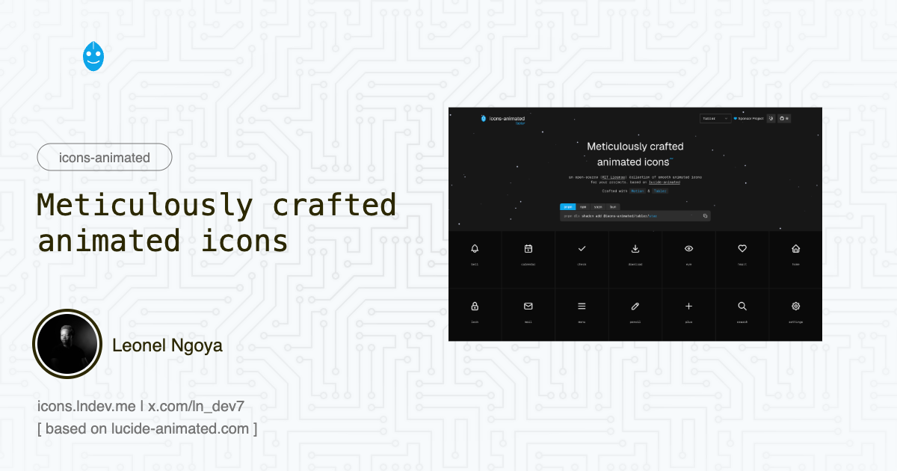

# icons-animated

Meticulously crafted animated icons for React, Vue 3 and Svelte 5.



> 🎄 Based on the amazing [lucide-animated](https://lucide-animated.com/) project by [@pqoqubbw](https://x.com/pqoqubbw)

## Links

- **Demo** → [icons.lndev.me](https://icons.lndev.me)
- **Sponsor** → [Support the project](https://lndev.mychariow.shop/prd_3cu1s0)
- **Original project** → [lucide-animated.com](https://lucide-animated.com/)

## Icon Libraries

This project provides animated icons for:

- **[Huge Icons](https://hugeicons.com/)** - A beautifully crafted icon library with 4000+ free icons
- **[Tabler Icons](https://tabler.io/icons)** - A set of free MIT-licensed high-quality SVG icons
- **[Phosphor Icons](https://phosphoricons.com/)** - A flexible icon family for interfaces, diagrams, presentations

## Installation

Install React icons with the shadcn CLI (for Vue and Svelte, see [below](#vue-and-svelte)):

```bash
# Huge Icons
pnpm dlx shadcn add @icons-animated/hugeicons-heart
pnpm dlx shadcn add @icons-animated/hugeicons-search

# Tabler Icons
pnpm dlx shadcn add @icons-animated/tabler-heart
pnpm dlx shadcn add @icons-animated/tabler-search

# Phosphor Icons
pnpm dlx shadcn add @icons-animated/phosphor-heart
pnpm dlx shadcn add @icons-animated/phosphor-star
```

For direct copy, use React 18.2+ and install the animation engine versions below. Keep `@/lib/utils` pointing to a `cn` helper: reuse your shadcn setup, or copy [our helper](lib/utils.ts) and install `clsx` and `tailwind-merge`. Preserve the license notice included in each copied component.

Icons retain their native library style. Phosphor regular icons use filled SVG paths: customize their `size` and CSS color; stroke width does not control their thickness.

## Vue and Svelte

Select the framework next to the site logo. **Copy code** returns a standalone `.tsx`, `.vue` or `.svelte` component; **Copy install command** uses the matching CLI. Every catalog icon is available in all three formats.

In a project initialized with the corresponding shadcn CLI:

```bash
pnpm dlx shadcn-vue@latest add https://icons.lndev.me/r/vue/hugeicons-heart.json
pnpm dlx shadcn-svelte@latest add https://icons.lndev.me/r/svelte/tabler-heart.json
```

For direct copy, install the pinned animation engine. These versions reproduce the engine used by the reference snapshot: changing a transitive Motion package can change SVG spring interpolation.

```bash
pnpm add motion@13.1.1 framer-motion@13.1.1 motion-dom@13.1.1 motion-utils@13.0.0
```

Registry installation supplies these versions automatically. Vue and Svelte components do not need React, Tailwind or a `cn` helper. Use Vue 3.5+ or Svelte 5.20+ for the stable instance-ID APIs used by SVG masks. Keep your lockfile to retain the verified Motion versions. The SVG size defaults to 28; set `size` and CSS `color` to customize it. Give the wrapper a `tabindex` when it should be keyboard focusable; label the surrounding control for accessibility.

```vue
<script setup lang="ts">
import HeartIcon from '@/components/ui/hugeicons-heart.vue';
</script>

<template>
  <HeartIcon :size="32" tabindex="0" role="img" aria-label="Favorite" />
</template>
```

```svelte
<script lang="ts">
  import HeartIcon from '$lib/components/ui/tabler-heart.svelte';
</script>

<HeartIcon size={32} tabindex={0} role="img" aria-label="Favorite" />
```

All formats support hover, keyboard focus, imperative playback and reduced motion. Animations follow the reference lifecycle: some hold their final pose or loop until stopped; they do not automatically reset after every cycle. React exposes `startAnimation()` / `stopAnimation()` through a ref; supplying a ref gives the parent control of playback. Vue exposes those methods on its component ref and Svelte through `bind:this`. Set `controlled` to `true` in Vue/Svelte when the parent should manage playback instead of hover/focus. The SVG itself is decorative (`aria-hidden`).

The gallery runs in React. Selecting Vue or Svelte changes the distributed source and installation command; both ports execute the same animation program, including controller sequences, state, timers and infinite loops, through Motion’s SVG engine.

See [animation parity and native-geometry limits](docs/ANIMATION_PARITY.md) for source attribution and per-icon deviations.

## Maintaining the three formats

Edit the canonical React source under `icons/`. Run `pnpm gen-cli` before committing: it regenerates Vue/Svelte components and all three public registries. Do not edit generated files under `frameworks/` or `public/r/` manually. The generator rejects unsupported source patterns instead of silently producing a static icon.

Run `pnpm check-frameworks` to compile every Vue and Svelte component. `pnpm check-registry` checks that each published component matches its generated source, and `pnpm check-icon-content` verifies source-copy isolation and framework-specific commands.

## Contributing

We welcome contributions to `icons-animated`! Please read our [contributing guidelines](CONTRIBUTING.md) on how to submit improvements and new icons.

## License

icons-animated is released under the [MIT License](LICENSE): you can use, modify and redistribute it in personal and commercial projects. The icon geometry comes from Hugeicons, Tabler and Phosphor, all MIT-licensed. Keep the license notice included in each component; see [third-party notices](THIRD_PARTY_NOTICES.md).

If you have any questions or just want to say hi, feel free to reach out to me on X 👉 [@ln_dev7](https://x.com/ln_dev7).

## Credits

- Original project: [lucide-animated](https://lucide-animated.com/) by [@pqoqubbw](https://x.com/pqoqubbw)
- Huge Icons: [hugeicons.com](https://hugeicons.com/)
- Tabler Icons: [tabler.io/icons](https://tabler.io/icons)
- Phosphor Icons: [phosphoricons.com](https://phosphoricons.com/)

## Notes

This project is a work in progress, and I'm continuously working to improve and expand this collection. I'd love to hear your feedback or see your contributions as the project evolves!
